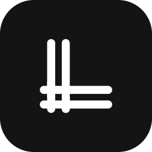
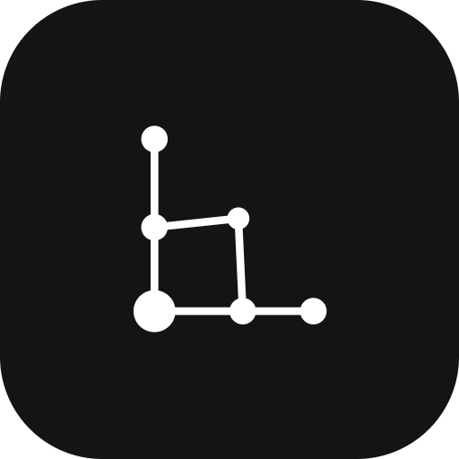

<div align="center">



# Loom OS

**Unified agent memory fabric**

</div>

**Loom OS** is a unified agent memory fabric that weaves multiple AI coding agents — Claude Code, Codex, Hermes, Cursor, and more — into one shared, [Graphify](https://github.com/nousresearch/graphify)-powered knowledge graph per project. Agents talk to Loom OS **only through the filesystem**: they drop files into a per-project inbox and the daemon does the rest. There is no SDK, no API client, and no auth. A Next.js dashboard is the control plane for browsing the graph, managing agents, and dispatching work.

> **Naming.** The product is **Loom OS**. The installable package is **`loom-os`** (`pip install loom-os`); the CLI command is **`loom`**. The repository directory and design/plan docs are named **`agentic-os`**. They all refer to the same project.

---

## Quick Start

```bash
pip install loom-os                         # base install — no LLM keys required
loom start                                  # starts daemon on http://127.0.0.1:8472
loom init --project my-app --project-path . # bootstraps inbox + starter register.json
# (or register a specific agent instead of init):
#   loom register --agent claude-code --project my-app --project-path /abs/path
open http://localhost:3000                  # dashboard (run the Next.js app — see below)
```

The dashboard is a Next.js app under `dashboard/`. Start it with:

```bash
cd dashboard && npm install && npm run dev   # http://localhost:3000
```

| What | Where |
|------|-------|
| Daemon (REST + WebSocket) | `http://127.0.0.1:8472` |
| Dashboard | `http://localhost:3000` |

**Prerequisites:** Python 3.11+, Node.js 20+. Graphify ships as a dependency (`graphifyy`).

> Want optional LLM-powered extraction (Ollama / OpenAI / Claude)?  
> `pip install loom-os[llm]` — the base install works without any LLM.

---

## Capabilities

- **Multi-agent knowledge graph** — Graphify parses your codebase AST (zero API keys, code-only builds) and builds a per-project graph of files, functions, classes, communities, and execution flows. An optional LLM extraction layer can enrich the graph with semantic edges.
- **Filesystem inbox protocol** — agents never call an API. They write files into `~/.loom/inbox/<project>/`: `register.json`, `heartbeat.json`, `finding-*.md` (markdown + YAML frontmatter), `decision-*.md` (ADRs), `task-*.json` (dispatched tasks). The daemon watches, processes, and moves each file to `.processed/`.
- **Next.js dashboard** — interactive graph visualization (reagraph/cytoscape), agent management with live status, a Kanban task board (Todo · Ready · Running · Blocked · Done), project CRUD, knowledge-source discovery, and hybrid search. Bilingual (en/ar) with RTL support.
- **Task dispatch + worker execution** — dispatch tasks from the dashboard; a `loom worker` process picks up Running tasks, executes them in an isolated **git worktree**, and enforces a per-task USD budget cap. Results flow back as findings.
- **Hybrid search** — text (FTS) + vector embeddings + graph traversal in a single query path.
- **Optional LLM backends** — Ollama (default, local), OpenAI, or Anthropic Claude. Install with `pip install loom-os[llm]`. The base package needs no LLM at all.
- **MCP server** — `loom-mcp` exposes graph queries and finding ingestion over the Model Context Protocol so any MCP-aware agent can read from and write to Loom OS.
- **Single-process daemon, zero infrastructure** — no Docker, no Neo4j, no cloud. One Python process (FastAPI + uvicorn) plus the Next.js dashboard. State lives in SQLite (`~/.loom/state.db`).

---

## Architecture

```
Browser :3000 ──▶  ┌──────────────────────────────────┐
                   │       Next.js Dashboard          │
                   └──────────────┬───────────────────┘
                                  │ REST + WebSocket
┌─────────────────────────────────┼───────────────────┐
│                  Loom Daemon (Python, :8472)          │
│                                                       │
│  watcher ──▶ router ──▶ registry / graph_engine ──▶ api
│                │              │                       │
│           (SQLite)      (Graphify CLI subprocess,     │
│           ~/.loom/       graph.json sidecar)          │
│            state.db                                     │
└───────────────────────────────────────────────────────┘
     ▲                  ▲                  ▲
     │                  │                  │
~/.loom/inbox/proj   ~/.loom/inbox/proj   ~/.loom/inbox/proj
  Claude Code           Codex              Hermes
```

**Two processes:**

1. **Python daemon** (`daemon/`) — FastAPI + uvicorn on `127.0.0.1:8472`. REST routes plus a single `/ws` WebSocket for live updates. CORS allows `http://localhost:3000`.
2. **Next.js dashboard** (`dashboard/`) — App Router on `:3000`. Talks to the daemon over REST + WebSocket.

**Filesystem protocol.** Agents write files into `~/.loom/inbox/<project>/`. The daemon watches the inbox, dispatches by filename, builds/updates the knowledge graph, and pushes live events to the dashboard.

**Daemon module map & data flow:**

```
watcher.py        watchdog observer on ~/.loom/inbox (recursive).
                  Marshals filesystem events onto the asyncio loop.
    ↓
router.py         Dispatches by filename → _handle_register, _handle_heartbeat,
                  _handle_finding, _handle_decision, _handle_task.
                  Moves processed files to .processed/. Rate-limits graph
                  updates (1 / 30s / project). Emits WsEvents to a queue.
    ↓
registry.py       AgentRegistry: aiosqlite over ~/.loom/state.db.
                  Tables: agents, projects, tasks. CRUD + graph-stat persistence.
graph_engine.py   GraphEngine: build / update / query / stats / topology /
                  communities / flows. Invokes `graphify` as a CLI subprocess
                  (asyncio.to_thread); reads <project>/graphify-out/graph.json.
extractors.py     Optional LLM extraction layer (injectable backend).
extracted_store.py  Sidecar store for LLM-extracted semantic edges.
api.py            FastAPI routes + WebSocket fan-out.
mcp_server.py     MCP server (loom-mcp entry point).
worker.py         Worker: executes Running tasks in git-worktree isolation.
```

---

## Benchmarks

[`BENCHMARKS.md`](BENCHMARKS.md) has reproducible, self-measured numbers for Loom OS
(build time, node/edge counts, query latency) against the repo's own commit SHA — see
[`benchmarks/README.md`](benchmarks/README.md) for the full reproduction runbook.

**Competitor numbers (Cognee, Graphiti) are not yet measured.** Both require a Docker +
Neo4j stack that hasn't been stood up in a controlled benchmark environment yet, so their
rows honestly render `not measured` rather than an estimate — Loom does not publish
competitor numbers it hasn't run itself.

---

## CLI Reference

| Command | Description |
|---------|-------------|
| `loom start` | Start the daemon (FastAPI + uvicorn on `:8472`) |
| `loom init --project <name> --project-path <path>` | Bootstrap a project: create inbox + starter `register.json` |
| `loom register --agent <name> --project <name> --project-path <path>` | Register a coding agent with a project |
| `loom unregister --agent <name> --project <name>` | Remove an agent from a project |
| `loom detect-agents` | List coding agents detected on this machine |
| `loom worker --project <name> --agent <name> --project-path <path>` | Run a worker that executes Running tasks (git worktree isolation, `--max-budget-usd` cap) |
| `loom-mcp` | Start the MCP server |

---

## Development

```bash
git clone https://github.com/mohamedhusseinios/Loom-OS.git
cd Loom-OS
python3 -m venv .venv && source .venv/bin/activate
pip install -e ".[dev]"

pytest tests/ -v              # full test suite (pytest-asyncio)
bash scripts/smoke-test.sh    # end-to-end: daemon + agent + API
cd dashboard && npm run dev   # dashboard hot-reload
```

See the [Development Guide](docs/DEVELOPMENT.md) for project structure, test patterns, and contribution conventions.

---

## Documentation

| Guide | Covers |
|-------|--------|
| [Architecture](docs/ARCHITECTURE.md) | Two-process design, module map, data flow, design principles |
| [Filesystem Protocol](docs/FILESYSTEM-PROTOCOL.md) | Full inbox protocol spec — every file type, format, processing rule |
| [API Reference](docs/API.md) | Complete REST + WebSocket API, all endpoints and event types |
| [Dashboard Guide](docs/DASHBOARD.md) | Page-by-page tour, tech stack, i18n, component map |
| [Task Board & Worker](docs/TASK-BOARD.md) | Kanban lifecycle, worker execution model, git worktree isolation |
| [Agent Lifecycle](docs/AGENT-LIFECYCLE.md) | Registration → contribution → dispatch flow, agent status, shared context |
| [Development Guide](docs/DEVELOPMENT.md) | Setup, project structure, test suite, daemon patterns, contribution conventions |
| [Benchmarks](BENCHMARKS.md) | Reproducible head-to-head numbers; [runbook](benchmarks/README.md) to regenerate them |

### Design specs & implementation plans

- [Design spec](docs/superpowers/specs/2026-06-25-agentic-os-design.md) — original system design
- [Dashboard features design](docs/superpowers/specs/2026-06-26-agentic-os-dashboard-features-design.md)
- [Kanban task board design](docs/superpowers/specs/2026-06-27-agentic-os-kanban-task-board-design.md)
- [Live task execution design](docs/superpowers/specs/2026-06-27-agentic-os-live-task-execution-design.md)
- [Multi-agent worker runners design](docs/superpowers/specs/2026-06-28-multi-agent-worker-runners-design.md)
- [Post-parity roadmap design](docs/superpowers/specs/2026-06-29-loom-post-parity-roadmap-design.md)
- [Implementation plan](docs/plans/2026-06-25-agentic-os-implementation.md)
- [Dashboard features plan](docs/plans/2026-06-26-dashboard-features-implementation.md)
- [Competitor gap-closure roadmap](docs/plans/2026-06-26-competitor-gap-closure-implementation.md)
- [Live task execution plan](docs/plans/2026-06-27-agentic-os-live-task-execution-implementation.md)
- [Post-parity roadmap plan](docs/plans/2026-06-29-post-parity-roadmap-implementation.md)

---

## Brand

Monochrome, geometric. **Warp** (an L woven on a loom) is the primary mark; **Lattice** (an L traced through a knowledge graph) is the alternate.

| | Warp (primary) | Lattice (alternate) |
|---|---|---|
| Icon |  |  |

- **Ink** `#141414` · **Paper** `#FFFFFF` · greys `#6F6F6F`, `#E5E5E5`
- **Wordmark** Space Grotesk 600, tracking −3.5%
- Full asset kit: [`docs/branding/`](docs/branding/README.md)

---

## License

MIT © Mohamed Hussien